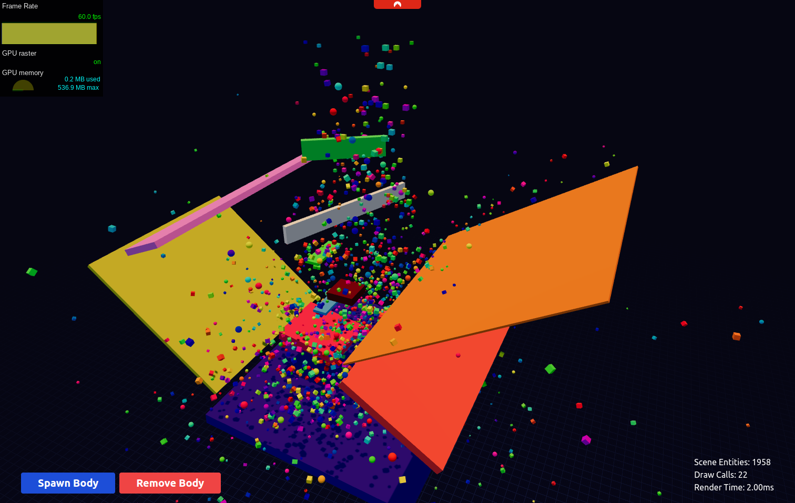

# Koota Carnival

👉 Check out the [Live Demo](https://codesandbox.io/p/github/Ctrlmonster/koota-batched-mesh/master)

This is a Physics + ECS Stress-Test using [Koota](https://github.com/pmndrs/koota), `BatchedMesh` and [JoltPhysics](https://github.com/jrouwe/JoltPhysics.js).

**Koota** is a brand new ecs library by **pmndrs**. Designed for highly dynamic realtime apps (i.e. games).
While the library is mostly finished, expect some small changes to happen.

